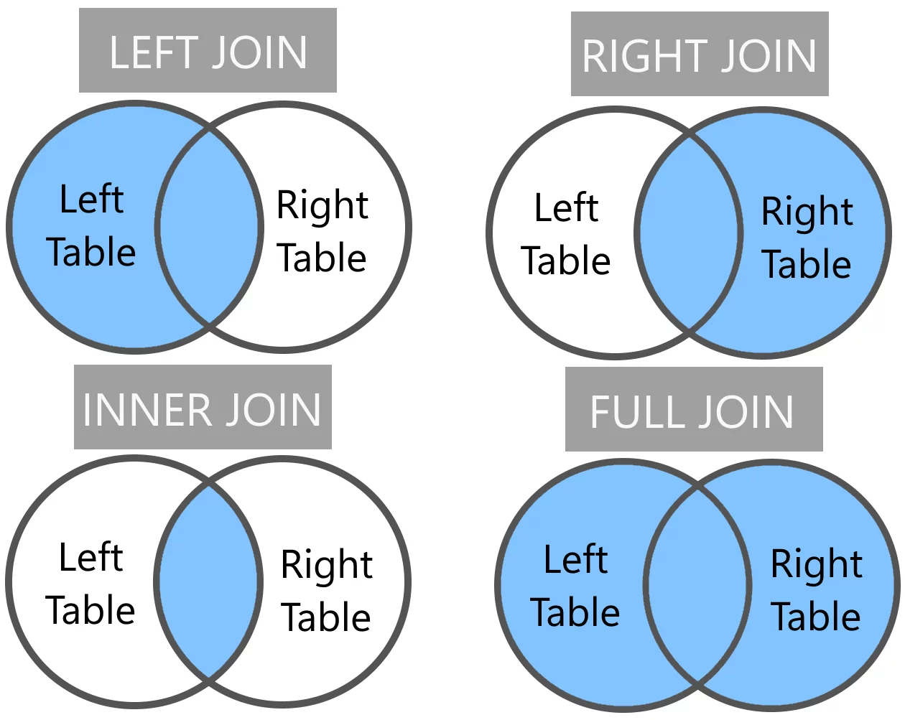

# Database Systems

### Type of Databases

Relational Databases are usually contain dynamic data that changes, and need to stay up to data at all time.&#x20;

Analytical Database are used to track trends&#x20;

### Where Clause

The where clause allow us to filter out data, that we have an result set, there are logical operations that be use in combination. To filter out data, in more detail here are some of the following operators:

#### LIKE&#x20;

Like allows us to find all results in  datasets, that match the value in the column

Example

```sql
SELECT * FROM class_room WHERE student_name LIKE "brian";
-- returns all students with the name that contains "brian"
```

#### AND

#### OR

#### NOT


### Outer Joins

```sql
SELECT column, another_column, ...
FROM mytable
INNER/LEFT/RIGHT/FULL JOIN another_table
    ON mytable.id = another_table.matching_id
WHERE condtion(s)
ORDER BY column, ... ASC/DESC
LIMIT num_limit OFFSET num_offset;
```

### Inner Joins

Allow table A and table B to join only there is an match found in both tables.

### Left Joins

When joining tables A and table B, left joins allow you to retrieve the data from table A regardless if there is a match from table B.

### Right Joins

When joining table A and table B, right joins do the opposite of the left join and select the data from the right table regardless if there is an match found in the table B.

### Full Joins

Allows table A and table B to join regardless if there is an match found in both table, the tables are joined together regardless of a match.

#### **Tip:&#x20;**<sup><sub>_**When using these queries you will likely have to write additional logic to deal with null values**_<sub></sup>

<figure><figcaption></figcaption></figure>

## Nulls

When querying some results may end up returning null values, with represents the absence of data, this can be filled with an default value data type, but in some situations such as doing algebra calculations nulls may be suited for the such

```sql
SELECT column, ...
FROM mytable
WHERE column IS NULL/NOT NULL
ORDER BY ASC/DESC
```

## Queries with expressions

