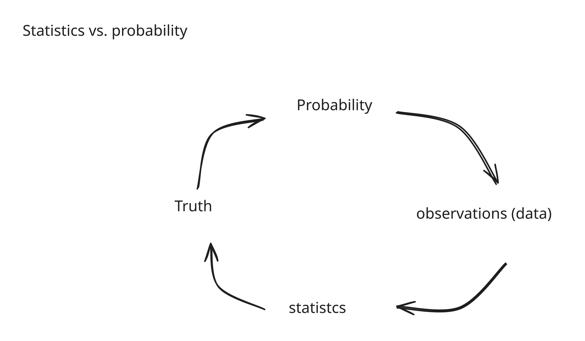

# Statistics

## Overview

This gives details about understanding the math behind statisical models, and give you information that can used to develop or help with your own internal models or help you develop one. Provides toolbox to extend other models.


### Probability

Is the studies of randomness, sometimes the physical process is completely known

#### Statistics and modeling

For complicated processes you need to estimate the parameters, that is called statistics

Sometimes real randomness ( random students ), sometimes too complex. Then you have to create statistical modeling. \
&#x20;  &#x20;

```
Complicated process = simple process + random noise
```


Random noise is everything that have been sweep, that we can find an average of some constant


Model should be complicated but not too complicate and should take in&#x20;


